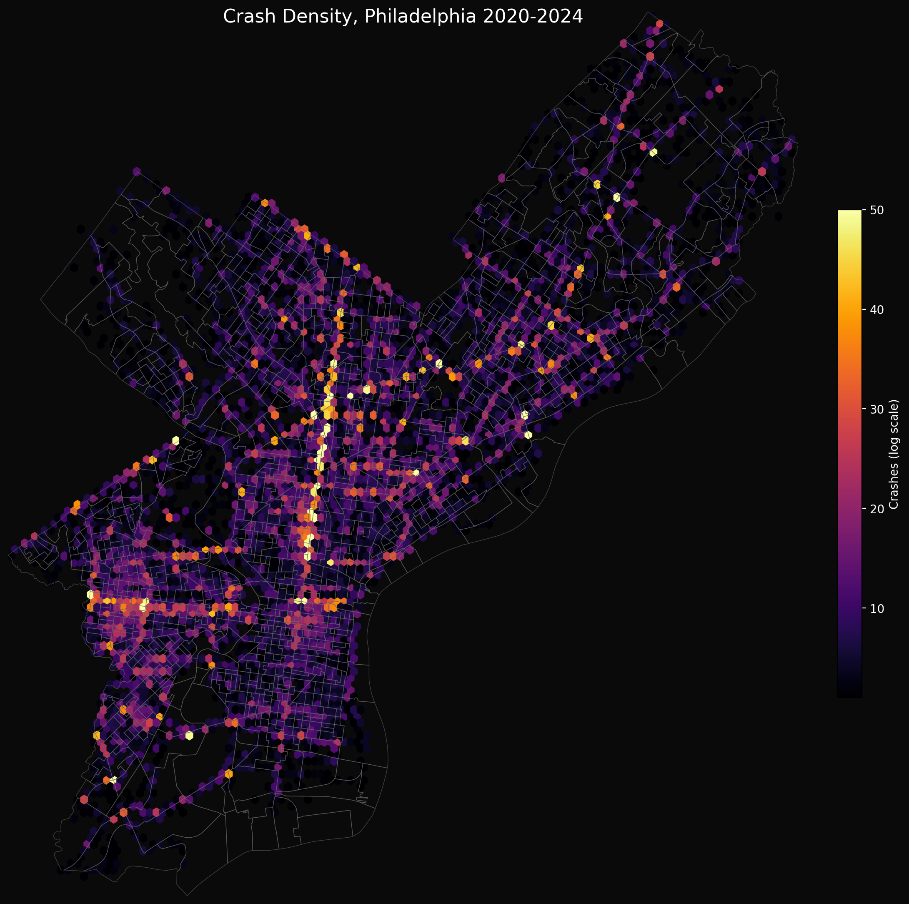
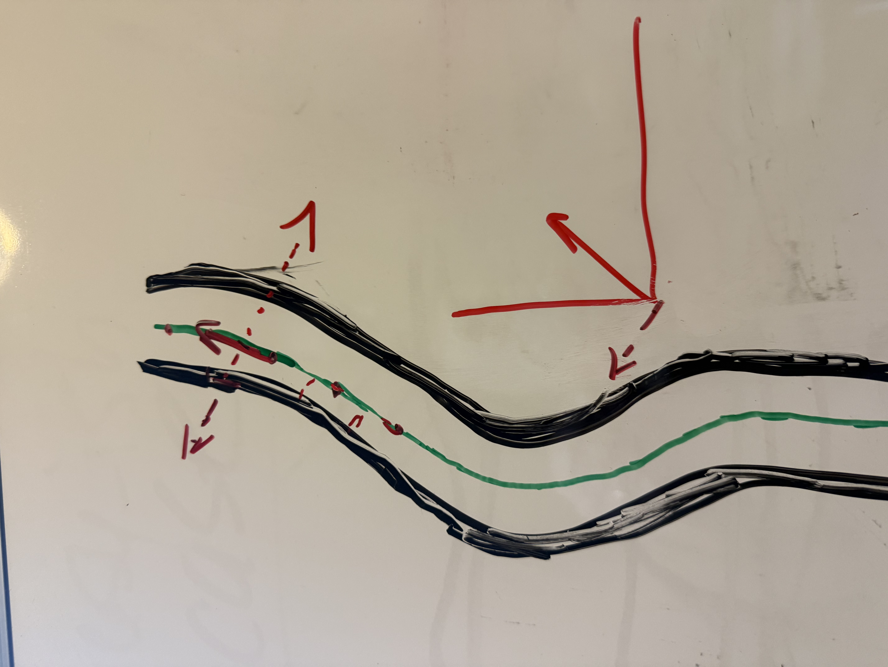

# Environmental features effect on road design

Do environmental features augment road design in predicting crash frequency?

---

## Data

**Crashes** - PennDOT crash records 2020-2024

**Road geometry** - Centerlines + curbs, state roads, OSM

**Traffic & infrastructure** - calming devices, intersection controls, DVRPC AADT 

**Environment** - Tree canopy raster, DEM, tree inventory

**Demographics** - Census ACS block groups

---

## Crash Density

- Hotspots on major arterials
- Roosevelt Blvd, Broad, Market visible

---

## Data Processing - Cartway Width Calculations

Create transects: Points -> Line Segments -> Vector -> Normal

<!-- 
- You'll need to explain some of the issues with the transect approach
- did you take median or mean of the transect widths?
- mention that this was fun, but there are probably more accurate ways:
  - High res imagery with manual extraction 90s-00s
  - 2010s more and more ML, by end of that decade, pretty much non-manual
-->

---

## Data Processing - Road Grading

- Point Sampling vs Zonal
<!-- 
- Discuss the naive and then back and forth approach.
-->

---
<!-- _color: white -->

## Data Processing 

### Road Grading

---

## Analysis

A less-than encouraging corrleation matrix.

 

---

## Analysis - Models

Some interesting models.

 

---

## Known Limitations

- Crash data is from 2020-2024, but some data from static times. Something to fix.
- Things like lanes, speed limits, traffic data, is extremely limited. Either state or other limits. 

---
